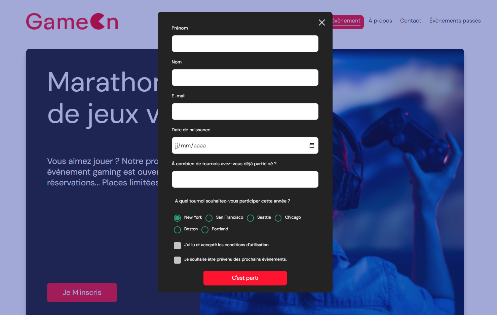

#  GameOn 

## Presentation:

GameOn is an app specialized in conferences and gaming competitions.

Figma models are available [here](https://www.figma.com/file/B7NKBDvSI18uoMLJgpnh48/UI-Design-GameOn-FR?type=design&node-id=106-630&mode=design)

## Project goals:

#### 1. [The existing codebase here](https://github.com/OpenClassrooms-Student-Center/GameOn-website-FR/) : test the UI in the latest versions of Chrome and Firefox, as well as mobile and desktop versions. Fix existing display errors.
#### 2. Implement the events subscribing form in JS Vanilla: inputs control with REGEX, error messages, confirmation modal on successful submit.  [Issues here](https://github.com/OpenClassrooms-Student-Center/GameOn-website-FR/issues)

## Local setup

1. Clone and/or fork this repository.
2. Then start your Live Server